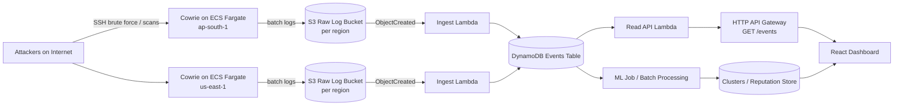

# System Architecture

## End-to-end flow

## Why this architecture

- **Fargate**: runs honeypots as containers with minimal server maintenance.
- **S3**: cheap, durable landing zone for raw logs and reprocessing.
- **Lambda**: event-driven parsing/normalization; scales with data.
- **DynamoDB**: fast reads for dashboard and simple scaling for event ingestion.
- **HTTP API**: lightweight public endpoint to power the dashboard feed.
- **ML batch**: unsupervised clustering can run periodically without impacting ingest.

## References

- AWS: S3 triggers Lambda (`Process Amazon S3 event notifications with Lambda`) `https://docs.aws.amazon.com/lambda/latest/dg/with-s3.html`
- AWS SAM policy templates (simplifies IAM in templates) `https://docs.aws.amazon.com/serverless-application-model/latest/developerguide/serverless-policy-templates.html`

